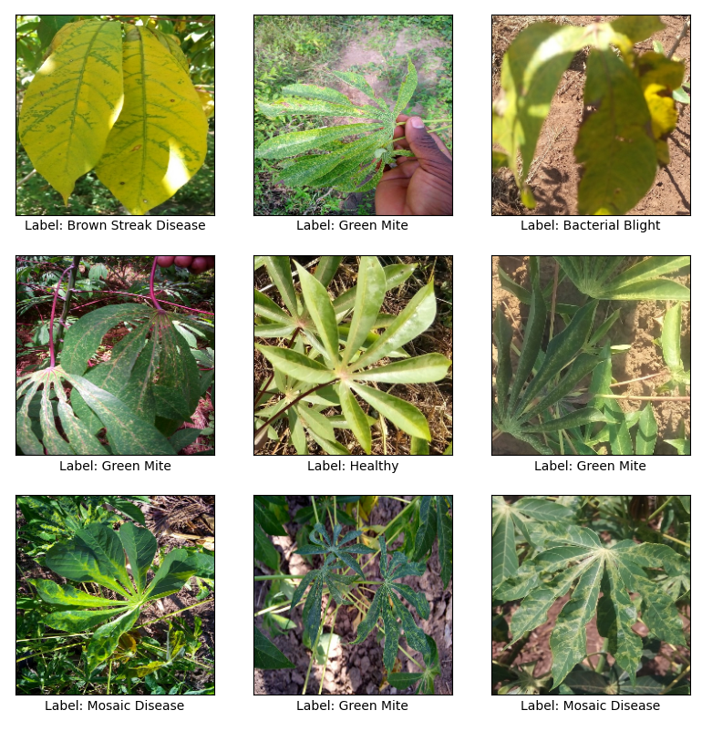
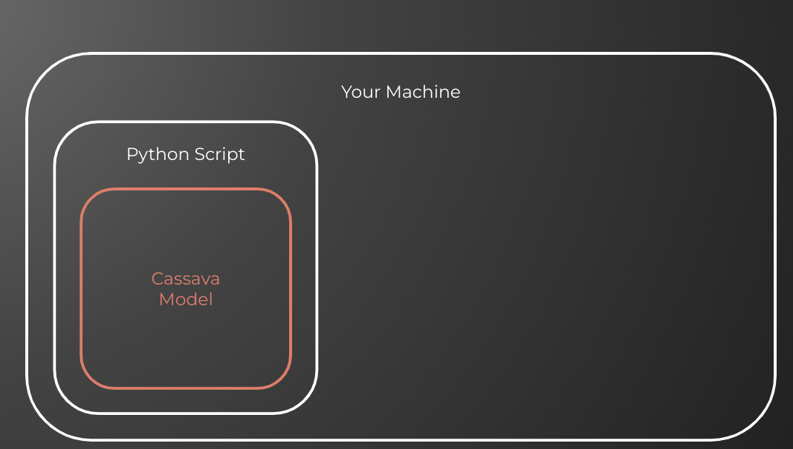
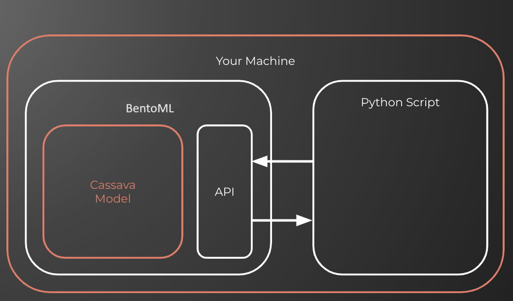
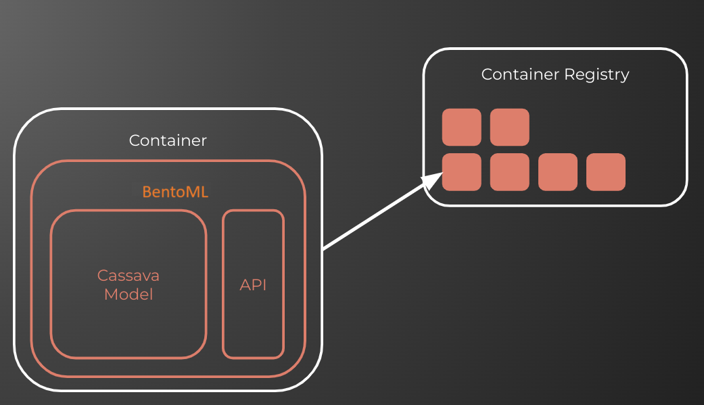
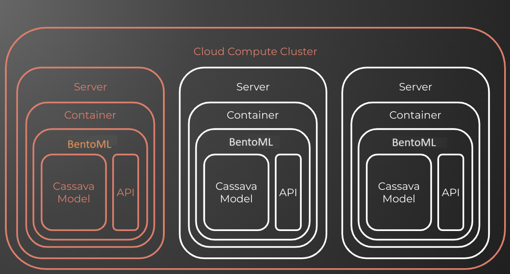

# Deploying a Custom Tensorflow Model with MLServer and Seldon Core

This demo is a shorter and slightly modified version of the tutorial created by Ed Shee, found [here](https://github.com/SeldonIO/cassava-example).

## Background

### Intro

This tutorial walks through the steps required to take a python ML model from your machine to a production deployment. More specifically we'll cover:
- Running the model locally
- Turning the ML model into an API
- Containerizing the model

### The Use Case

For this tutorial, we're going to use the [Cassava dataset](https://www.tensorflow.org/datasets/catalog/cassava) available from the Tensorflow Catalog. This dataset includes leaf images from the cassava plant. Each plant can be classified as either "healthly" or as having one of four diseases (Mosaic Disease, Bacterial Blight, Green Mite, Brown Streak Disease).



We won't go through the steps of training the classifier. Instead, we'll be using a pre-trained one available on TensorFlow Hub. You can find the [model details here](https://tfhub.dev/google/cropnet/classifier/cassava_disease_V1/2). 

## Getting Set Up

The easiest way to run this example is to clone the repository. Once you've done that, you can just run:

```Python
pip install -r requirements.txt
```

And it'll set you up with all the libraries required to run the code. The essential libraries are:

```
bentoml
numpy
matplotlib
tensorflow>2.0.0
tensorflow-hub
tensorflow-datasets
```

## Running The Python App

The starting point for this tutorial is python script `app.py`. This is typical of the kind of python code we'd run standalone or in a jupyter notebook. Let's familiarise ourself with the code:

```Python
from helpers import plot, preprocess
import tensorflow as tf
import tensorflow_datasets as tfds
import tensorflow_hub as hub

# Fixes an issue with Jax and TF competing for GPU
tf.config.experimental.set_visible_devices([], 'GPU')

# Load the model
model_path = './model'
classifier = hub.KerasLayer(model_path)

# Load the dataset and store the class names
dataset, info = tfds.load('cassava', with_info=True)
class_names = info.features['label'].names + ['unknown']

# Select a batch of examples and plot them
batch_size = 9
batch = dataset['validation'].map(preprocess).batch(batch_size).as_numpy_iterator()
examples = next(batch)
plot(examples, class_names)

# Generate predictions for the batch and plot them against their labels
predictions = classifier(examples['image'])
predictions_max = tf.argmax(predictions, axis=-1)
print(predictions_max)
plot(examples, class_names, predictions_max)
```

First up, we're importing a couple of functions from our `helpers.py` file:
- `plot` provides the visualisation of the samples, labels and predictions.
- `preprocess` is used to resize images to 224x224 pixels and normalize the RGB values.

The rest of the code is fairly self-explanatory from the comments. We load the model and dataset, select some examples, make predictions and then plot the results.

Try it yourself by running:

```Bash
python app.py
```

Here's what our setup currently looks like:


## Creating an API for The Model

The problem with running our code like we did earlier is that it's not accessible to anyone who doesn't have the python script (and all of it's dependencies). A good way to solve this is to turn our model into an API. 

Typically people turn to popular python web servers like [Flask](https://github.com/pallets/flask) or [FastAPI](https://github.com/tiangolo/fastapi). This is a good approach and gives us lots of flexibility but it also requires us to do a lot of the work ourselves. We need to impelement routes, set up logging, capture metrics and define an API schema among other things. A simpler way to tackle this problem is to use an inference server. For this tutorial we're going to use the open source [BentoML](https://github.com/bentoml/BentoML) framework.

### Setting Things Up

In order to get our model ready to run on BentoML we need to wrap it in a single class that represents a service around our model.BentoML uses decoractors to signify service class (`@bentoml.service`) and its functions (`@bentoml.api`). Let's take a look at the code (found in `model/service.py`):

```Python
import numpy as np
import tensorflow as tf
import tensorflow_hub as hub
import bentoml

# Define a service around our Model
@bentoml.service
class CassavaModel:

  def __init__(self) -> None:
    # Load the model into memory
    tf.config.experimental.set_visible_devices([], 'GPU')
    model_path = './model'
    self._model = hub.KerasLayer(model_path)

  # Logic for making predictions against our model
  @bentoml.api
  async def predict(self, payload: np.ndarray) -> np.ndarray:
    # convert payload to tf.tensor
    payload_tensor = tf.constant(payload)

    # Make predictions
    predictions = self._model(payload_tensor)
    predictions_max = tf.argmax(predictions, axis=-1)

    # convert predictions to np.ndarray
    response_data = np.array(predictions_max)

    return response_data
```

The `__init__()` method is used to define any logic required to set up our model for inference. In our case, we're loading the model weights into `self._model`. The `predict()` method is where we include all of our prediction logic.  

You may notice that we've slightly modified our code from earlier (in `app.py`). The biggest change is that it is now wrapped in a single class `CassavaModel`, which now represents a service with a single function: `predict`.

### Serving The Model

We're now ready to serve our model with MLServer. To do that we can simply run:

```bash
bentoml serve model.service:CassavaModel
```

BentoML will now start an HTTP server, load our CassavaModel service and provide access through a REST API.

### Making Predictions Using The API

Now that our API is up and running. Open a new terminal window and navigate back to the root of this repository. We can then send predictions to our api using the `test.py` file by running:

```bash
python test.py
```

Our setup has now evolved and looks like this:


## Containerizing The Model

[Containers](https://en.wikipedia.org/wiki/Containerization_(computing)) are an easy way to package our application together with it's runtime and dependencies. More importantly, containerizing our model allows it to run in a variety of different environments. 

> **Note:** you will need [Docker](https://www.docker.com/) installed to run this section of the tutorial.

Taking our model and packaging it into a container manually can be a pretty tricky process and requires knowledge of writing Dockerfiles. Thankfully BentoML, just as many other similar tools, removes this complexity and provides us with a simple `build` command.

Before we run this command, we need to provide our dependencies in a `requirements.txt` file. The requirements file we'll use for this example is stored in `model/requirements.txt`:

```
tensorflow==2.16.1
tensorflow-hub==0.16.1
```

> Notice that we didn't need to include `bentoml` in our requirements? This will be added automatically.

We also need to provide a configuration file to let BentoML know what we are building. Have a look at the [bentofile.yaml](model/bentofile.yaml).

We're now ready to build our container image using:

```bash
bentoml build --containerize
```

BentoML will now build the model into a container image for us. The `--containerize` tells it to prepare an actual Docker image. We can check the output of this by running:

```bash
docker images
```

If you have an access to a container registry, e.g. an account at Docker Hub, you can consider pushing this image there

```bash
docker push [YOUR_CONTAINER_REGISTRY]/[IMAGE_NAME]
```

Our setup now looks like this. Where our model has been packaged and sent to a container registry:


## Deploying your model

Having a Docker container with an API running your model is already a powerful setup that shall unlock many use cases. This is where current demo ends. However there are more steps that can be taken from here.

Docker containers are often deployed to a container orchestration clusters, using systems such as Kubernetes or Nomad. These systems automate management of containers: starting and stopping them, scaling up or down depending on the incoming traffic, monitoring their state, all in cloud native and provider independent fashion. The eventual setup of a model inside a Docker container running on a Kubernetes cluster looks something like that: 

If you are interested in these advanced topics, please refer to the [original tutorial](https://github.com/SeldonIO/cassava-example).
